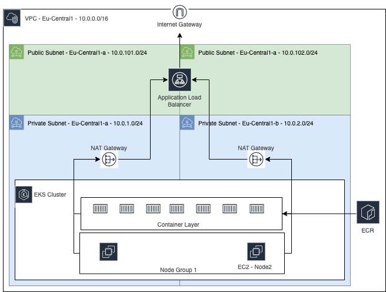

MatchUp is currently in the process of moving off of Vercel to its own AWS EKS Cluster.

This repo contains the following infrastucture:

-   AWS VPC
    -   two subnets spread across two regions in one AZ
-   AWS EKS Cluster
    -   Single Node group
-   Required IAM Roles and Polices
-   Kubernetes deployment
    -   Prometheus Helm Chart
    -   Grafana Helm Chart
    -   Karpanter node autoscaling provisioner
    -   AWS Load balancer controller
    -   Custom personal application deployment
    -   Ingress rules for application load balacer(ALB) setup
-   Route53
    -   Hosted zone
    -   A name records
    -   SSL cert in AWS Cert Manager

 

## Setup

### Variables

The following variables will need to be configured in your CI/CD pipeline or local environment variables. This repo comes with a simple example pipeline for CircleCI.

_AWS_ACCESS_KEY_ID = "sample_ID"_  
_AWS_SECRET_ACCESS_KEY = "sample_key"_  

The following will need to be configured in your local "terraform.tfvars" file. If using a CI/CD pipeline they will be added as environment variables with the TF_VAR abbreviation.

_GRAFANA_ADMIN = "sample_user"_  
_GRAFANA_PASSWORD = "sample_password"_  

_TF_VAR_GRAFANA_ADMIN = "sample_user"_  
_TF_VAR_GRAFANA_PASSWORD = "sample_password"_  

### Terraform

The Terraform backend for this project is configured for S3. This configuration can be found in _main.tf_ and will need to match your configuration for your S3 bucket. More information can be found [here](https://www.terraform.io/language/settings/backends/s3). If you wish to just use a simple local state file then remove the backend configuration in _main.tf_ entirely.

### Helm

You will need to add the required helm repos to your local system or have these commands run before a terraform apply within your pipeline setup. Run the following commands:

_helm repo add grafana https://grafana.github.io/helm-charts_  
_helm repo add prometheus-community https://prometheus-community.github.io/helm-charts_  
_helm repo add eks https://aws.github.io/eks-charts_  
_helm repo update_

For further helm customization see the available parameters for Grafana [Here](https://artifacthub.io/packages/helm/grafana/grafana#configuration) and Prometheus [Here](https://artifacthub.io/packages/helm/prometheus-community/prometheus). These paremeters can be added via _set_ within the Terraform Helm Release Resource with examples [Here](https://registry.terraform.io/providers/hashicorp/helm/latest/docs/resources/release#example-usage---chart-repository) and within the kubernetes.tf file.

This deployment uses Karpenter based horizontal node scaling. If you have never run spot instaces on your aws account before the following command will need to be run via the aws cli:
 
_aws iam create-service-linked-role --aws-service-name spot.amazonaws.com_

## Deployment

To view the planned deployment run the following command:  
_terraform plan -out=plan.file_

To deploy the infrastructure into your aws environment run the following command:   _terraform apply "plan.file"_

To destroy this infrastructure and start from a clean slate run the following command:  
_terraform destroy_

## Access to Grafana

The Terraform output should include a variable called _load_balancer_hostname_  

This is the url for Grafana access.

## Troubleshooting Notes

Note that the helm resource in kubernetes.tf requires a minimum aws cli version to use the exec plugin to retrieve the cluster access token.

-   See GitHub related issue [link](https://github.com/aws/aws-cli/issues/6920)

If you get the error _"terraform helm cannot reuse a name that is still in use"_ on a _terraform destroy_

you will need to run the following commands through kubectl:

1. _kubectl -n (namespace) get secrets_
2. for any secret of type helm.sh/release.v1 run the following command on
3. _kubectl delete secret (SecretName) -n (namespace)_
4. rerun _terraform destory_
